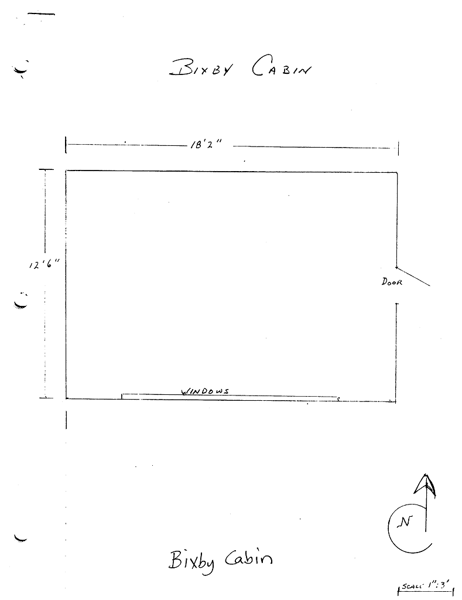

# Bixby Cabin

- Name(s)
- Description
  + Size: 19' x 24'
  + Woodframed construction on post and pier foundation. Partial concrete foundation. Roof is roll roofing on a unique ‘bowed’ frame.
- Location
  + Near theater trailhead.
- Purpose
  + Sleeping cabin
  + Storage
- Events
    - Constructed: 1919
    - Closed: 1997

# History

#### 2022

Visual inspection reveals nearly all supporting wood is nearly rotted away. Only the original windows are salvagable. The only hope of preservation is to document the structure and rebuild. [ms2022]

#### 2000

The building is on a hillside and has a partial concrete foundation installed. A large area of wood ground contact has caused significant deterioration along one side of the foundation. Significant floor deflection is noted as the building has settled to the downhill side. The current foundation is inadequate to support the building. [kpr2018]

#### 1997

Closed. [kpr2018]

#### 1919

C. M. Bixby built this cabin for his own use. He owned the grocery store in Chico where the Steamer Reeve docked. The Mountaineers purchased all their weekend supplies from Mr. Bixby who then hauled the groceries plus camping equipment to the lodge via his horse-drawn wagon. [kpr2018]

[ms2022]: https://meanylodge.github.io/Person/Matt-Simerson/
[kpr2018]: https://github.com/Mountaineers/Kitsap-Forest-Theater/blob/gh-pages/reference/2018-Property-Report.pdf