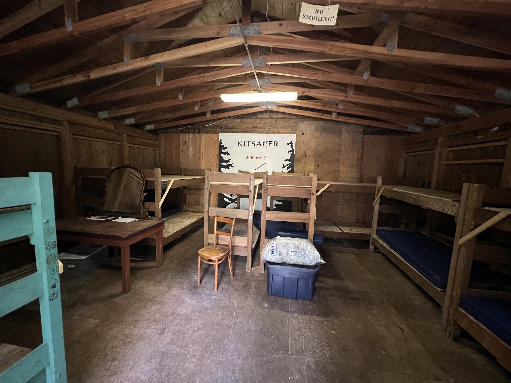

# Cascade Dorm

- Description
    - 20' x 37' split in half
    - woodframed construction on post and concrete pier foundation. Metal Snap-Loc roof on plywood deck. T-111 siding. [kpr2018]
- Location
    + Between theater trailhead and [cabin](../Kitsap-Cabin)
- Purpose
    - Lodging, sleeps up to 30
- Events
    - Constructed: 1965

 

# History

#### 2022

Cabin smells of mildew. Players were choosing to sleep outside in tents instead of in the building. [ms2022]

#### 2017

Wood preservative applied to outside of cabin. [kpr2018]

#### 2012

Sheetrock/insulation removed from men’s side because of mold and rat nests. [kpr2018]

#### 1965

Constructed on a weekend day by a crew from Meany Lodge, including [Ray Nelson](https://meanylodge.github.io/Person/Ray-Nelson/). [ms2022]

[ms2022]: https://meanylodge.github.io/Person/Matt-Simerson/
[kpr2018]: https://github.com/Mountaineers/Kitsap-Forest-Theater/blob/gh-pages/reference/2018-Property-Report.pdf
