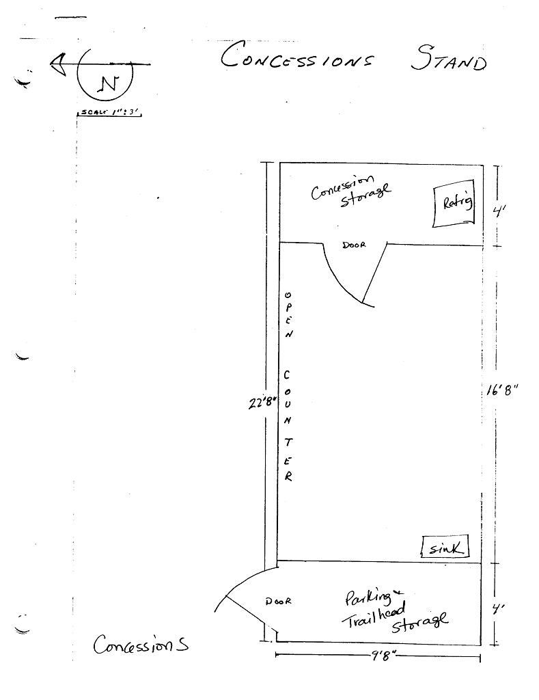

# Concession Stand

- Name(s)
    + Concessions Stand
    + Concessions Building
- Description
    - 23' x 10'
    - (2) 4' storage rooms at either end.
    - Large 5 inch support posts lashed to concrete piers with metal fasteners.
    - Concrete floor in main selling area.
    - Roll roofing on plywood deck.
    - Enclosed storage areas on either end, one has concrete slab floor and is rodent-proof for food storage.
    - Large open section in the middle with counter for food sales.
- Location
    + Near theater trailhead.
- Purpose
    - Food service
    - Storage of signage
    - portable temporary trailhead ‘box office’kiosks.
    - Storage of food and supplies for concession.
    - Sale of food during play.
- Events
    - Constructed: 1985 [kpr2018]
    - Expanded: 1992

# History

#### 2014
- Motion detector light installed. [kpr2018]

#### 2003

Concrete floor in main selling area. [kpr2018]

[kpr2018]: https://github.com/Mountaineers/Kitsap-Forest-Theater/blob/gh-pages/reference/2018-Property-Report.pdf
