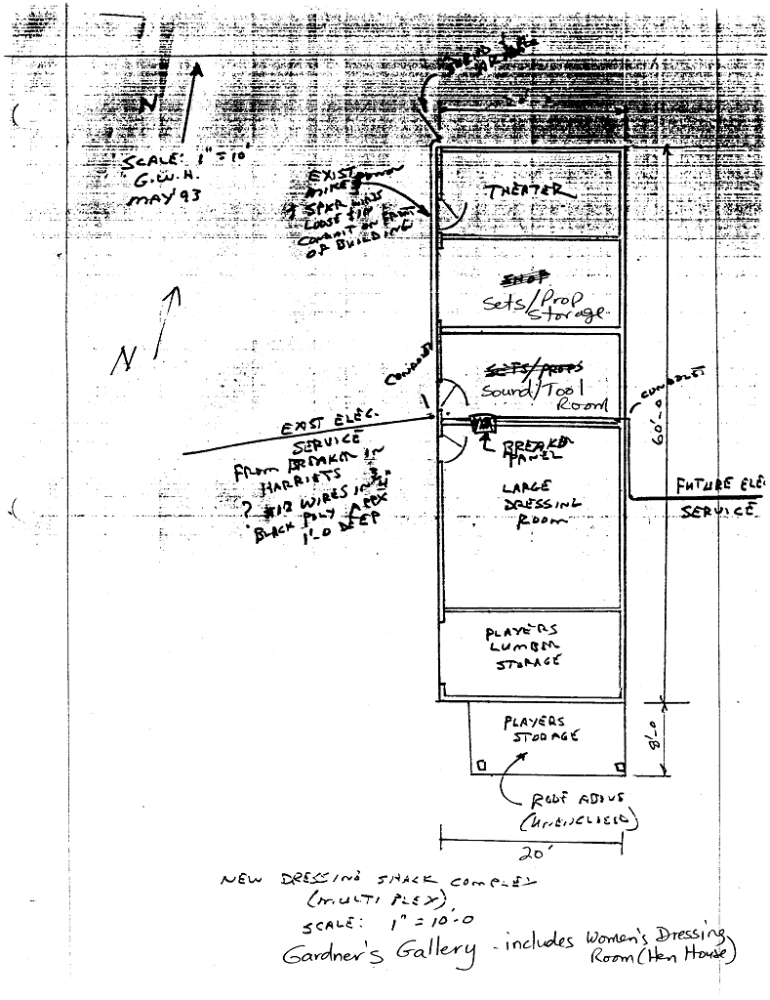

# Gardner's Gallery

- Name(s)
    - Hen House
- Description
    - 68' x ~10-12'
    - Rooms
        - Theater Tool Room
        - Sets / Prop Storage
        - Sound / Tool Room
        - Women's Dressing Room
        - Player's Lumber Storage
- Location
    - Theater
- Purpose
    - Theater Tool Room
    - Women's Dressing Room
- Events
    - Constructed: YYYY
    - Expanded: YYYY

# History
