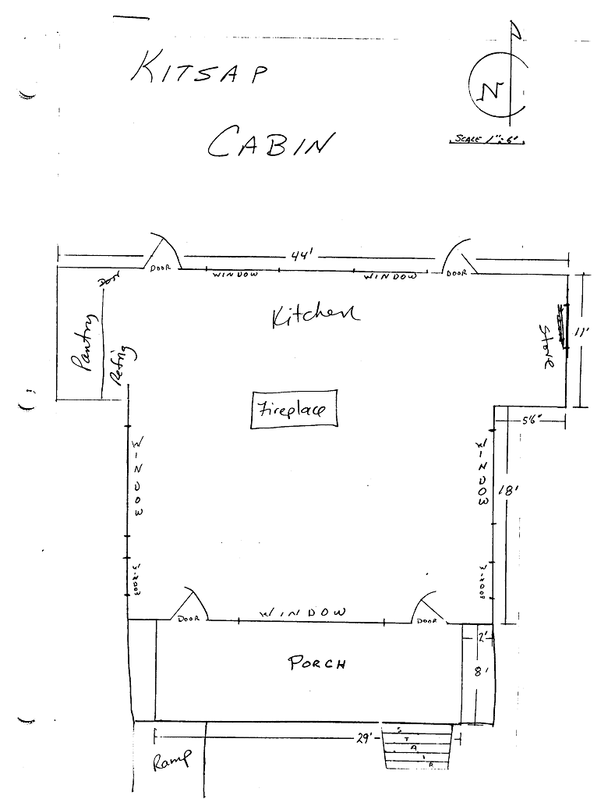
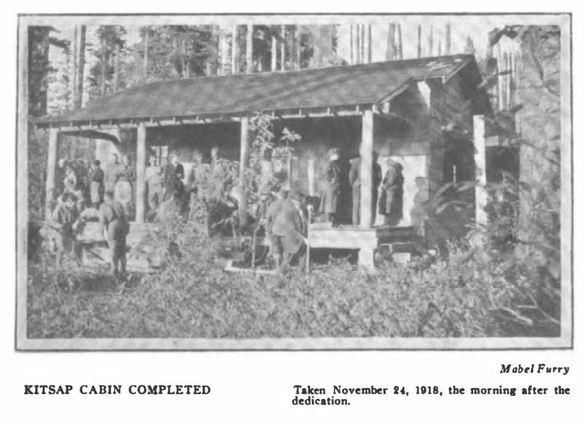
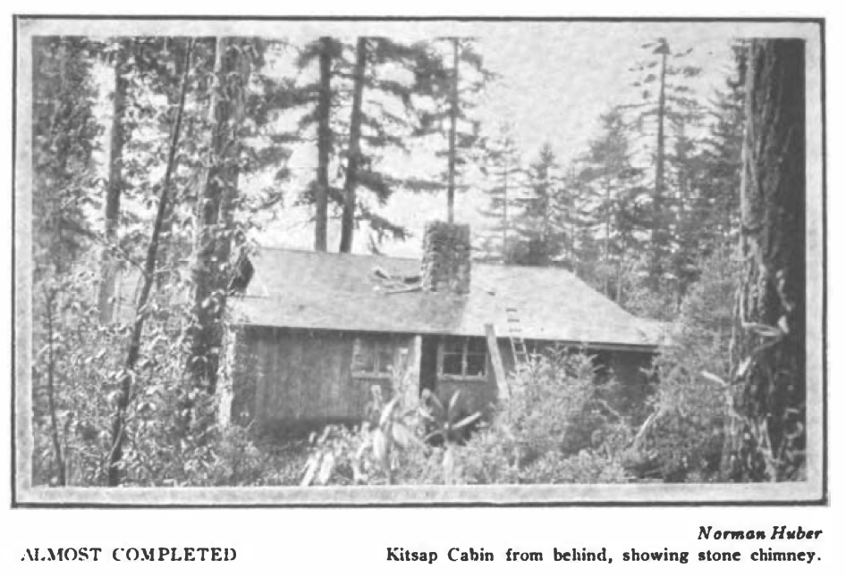
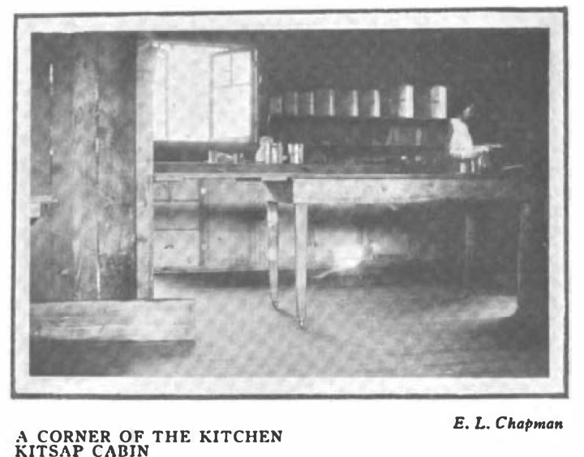
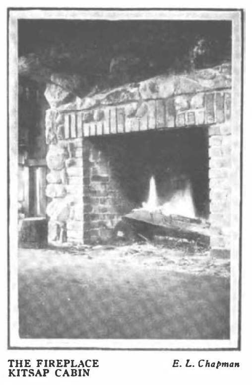

# Kitsap Cabin

- Name(s)
  * Kitsap Cabin
  * Cabin
- Location
  * Up Top
- Purpose
  + Cooking, Dining, and Gathering space.
- Description
  + 44' x 29' with 29'x8' porch
  + Wood frame construction on post and pier foundation. Decra metal tile roof (new 2003). Commercial-grade kitchen facility and large multipurpose room containing a stone fireplace.
- Rooms
  + Kitchen
    * Appliances
      - 6 burner commercial gas range
      - 43.5 cu. Ft. Delfield commercial refrigerator
      - 40 gallon electric water heater
      - Class 1 Stove Hood with fire suppression system 
    * Custom 10’4” x 3’ stainless steel sink island with 5 custom sinks
    * Plumbing (copper and pvc)
    * Heat Pump with two inside units
    * Septic System on the west side of the cabin to handle drain water
- Events
  - Constructed: 1918
  - Restored: 2002

### History

#### 2014

Septic system installed.

#### 2013

- Kitchen floor removed to joists – some joists replaced and new subfloor and tile installed. Joists on kitchen side of fireplace attached to fireplace foundation.
- New fridge, water heater, fire suppression system, kitchen island, plumbing, 

#### 2012

Installed heat pumps.

#### 2010

New gas range.

#### 2008

Siding replaced. Windows replaced or repaired.

#### 2003

Rafter ties reinforced.

#### 2002

Foundation replacement, new porches, ADA Handicapped Ramp. Stone fireplace rebuild.

#### 1918

