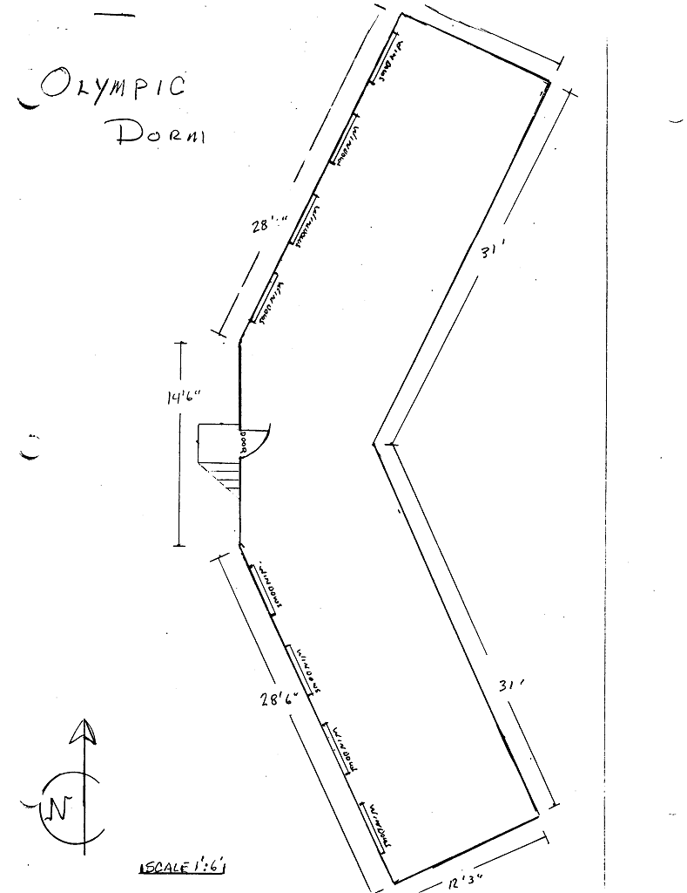

# Olympic Dormitory

<!-- - Name(s) -->
- Description
  + 60' x 18' C-shaped building
  + Dimensional wood frame construction on post and wood pier foundation. Lap siding on 2x4 frame. Cedar shake roof on steep pitch.
- Location
  + Beyond the [Cabin](../Cabin)
- Purpose
  + Lodging, sleeps 30
  + Prop storage.
- Events
    - Constructed: 1928

# History

#### 2000

Foundation contains wood piers sitting directly on the ground. Foundation requires replacement to correct ground contact problem. Structural reinforcement and retrofitting for lateral forces required. Roof needs fixing, cleaning and preservative application (in addition to more shingles).

#### 1971

Cedar shake roof installed.

#### 1928

Designed and built by Arthur Loveless and Walt Little it is believed[kpr18]

[kpr18]: /reference/2018-Property-Report.pdf