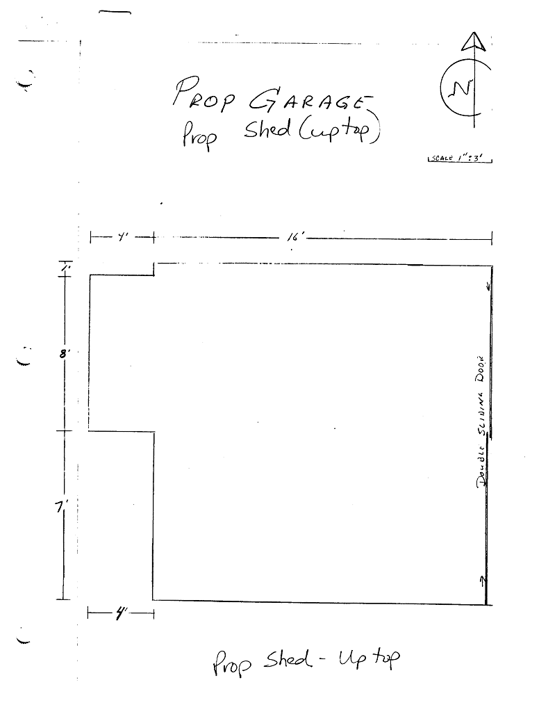

# Prop Garage

- Name(s)
  + Prop Garage
  + The Garage
- Description
  - 20' x 16'
  + Wood-framed construction on post and pier foundation.
  + Two large bypass sliding doors on building front.
  + Electrical – romex
  + Roll roofing – age unknown
- Location
  + Near theater trailhead.
- Purpose
  + Prop Storage
- Events
  - Constructed: ~1920

# History

#### 2005

The front of the building jacked up to free sliding doors.
