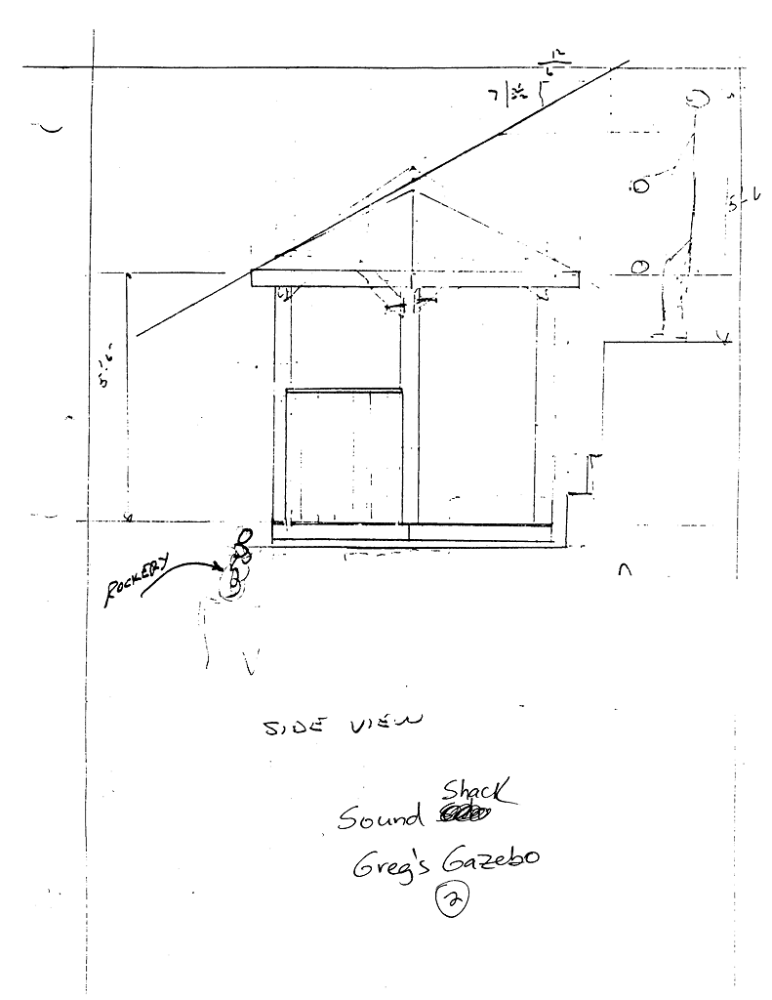

# Sound Shack

- Name(s)
  + Sound Shack
  + Greg's Gazebo
- Description
  + 8' x 8' octagon
  + Woodframed construction on concrete pier foundation.
  + Cedar shake roof on plywood decking.
- Location
  + In the theater seating area.
- Purpose
  + Houses sound and communications equipment during performances.
- Events
    - Constructed: 1993

- 

# History

