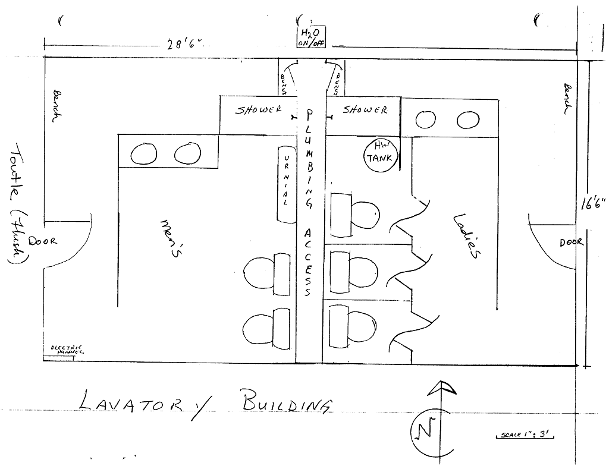

# Toutle

- Name(s)
  + Restrooms
  + Flushing restrooms
- Description
    - 28' x 16' building
    - 3 ladies stalls, 2 mens toilets plus urinal
    - 1 shower each
    - Bench seating outside the water closets
- Location
- Purpose
    - Utility
- Events
    - Constructed: Before 1973
    - Expanded: YYYY

# History
