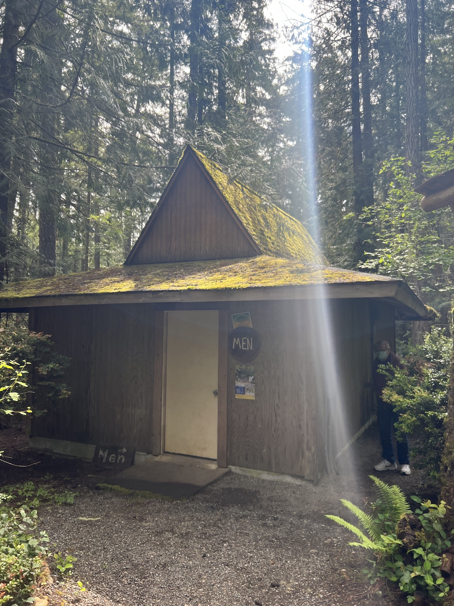

# Toutle

- Name(s)
  + Restrooms
  + Flushing restrooms
- Description
    - 29' x 17' building
    - 3 ladies stalls, 2 mens toilets plus urinal
    - 1 shower each
    - Bench seating outside the water closets
    - woodframed construction on concrete slab foundation. Roll roofing roof on plywood deck. T-111 siding.
- Location
    + Near the theater trailhead.
- Purpose
    - Sanitation
- Events
    - Constructed: 1968

# History

#### 2014

- new shower heads installed

#### 2013

- Copper plumbing to toilets replaced
- new faucets and new sinks (4)
- 4 TOTO toilets
- septic tank pumped
- men's vanity repaired

#### 2011

- 85 gallon electric water heater
- 1 Kohler toilet
- Interior walls painted (poorly) by old caretaker
- Women’s vanity and mirror (free from craigslist) installed

#### 2009

- Roll roofing replaced

#### 2004

- Men’s vanity installed

#### 2002

Wiring upgraded to meet current electrical code

#### 2000
- Floor painted

#### 1999
- Plumbing – copper supply and shutoff plumbing
- Septic system (drain field & tank upgraded/repaired 1998/1999)

#### 198?
 
Named after the Toutle River, which was flowing with sludge after Mt. St. Helens blew.[bl]

[bl]: /Person/Brian-Lindvall
