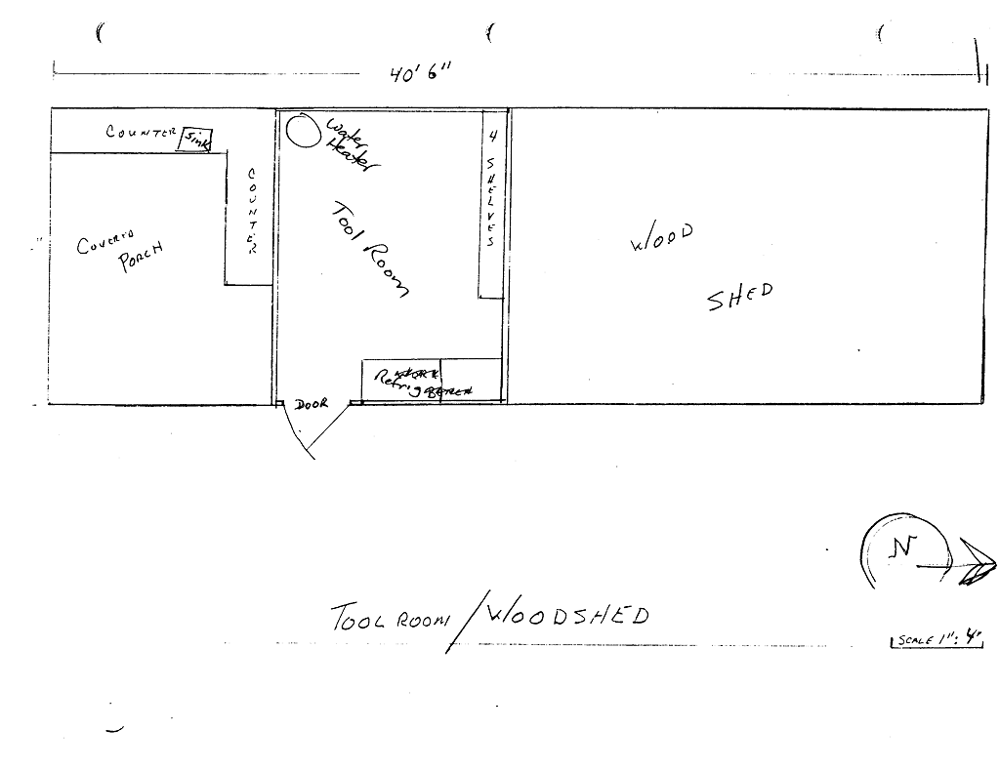

# Woodshed

- Name(s)
  + Woodshed
- Description
  - Size: 40' x 16' with 2 enclosed rooms and a 10' x 10' covered porch
  - Large 8 inch support posts lashed to slab foundation with steel straps. Lateral supports bolted to posts, supporting modern roof truss system. Roll roofing on pressure treated plywood decking.
- Location
  + Behind the [Cabin](../Kitsap-Cabin)
- Purpose
  + Firewood storage
  + Building materials storage
  + Tool Storage
    * Utility: water heater, fridges
- Events
    - Constructed: 1975

# History

#### 2002

New electrical service and main installed and wiring upgraded to meet current electrical code.

#### 2001

Application of wood preservative at bottom of main support posts applied.

#### 2000

Roof and roof decking replaced.

